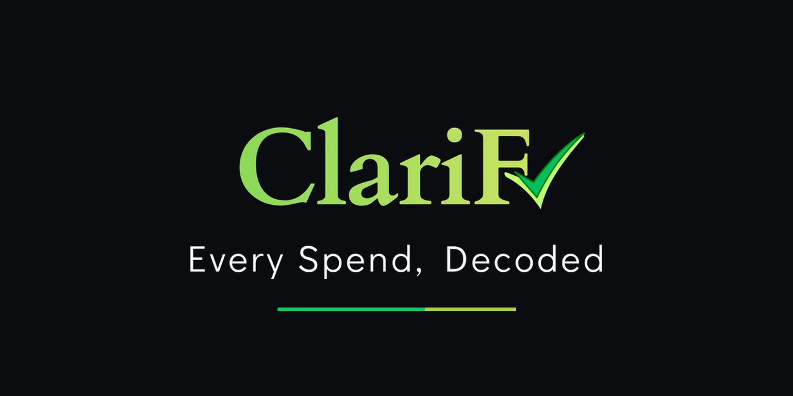

  

  <b>Turn your bank or UPI statement into a clear Profit &amp; Loss statement.</b> 
  Runs entirely in your browser. No account, no server, no data leaves your device.

---

## The problem

UPI made paying effortless. It also made spending invisible. A single month can hold
sixty or more transactions - ₹47 for a metro ride, ₹15 at a shop, ₹1,200 to a name you
no longer recognise. By month end, most of us cannot say where the money went.

The existing options each ask for something in return. Many expense apps want access to
your SMS inbox, your bank login, or your financial history on their servers. The
privacy-respecting alternatives ask you to type in every transaction by hand, which
almost nobody sustains.

ClariFi is a third option.

## What it does

Upload a bank or UPI statement. ClariFi reads it, sorts it, and gives you a financial
statement you can keep.

- **Reads your statement automatically** - CSV, TXT and PDF, with no manual entry
- **Detects the reporting period itself** from the transaction dates, and labels the
  report monthly, yearly or multi-year accordingly
- **Categorises every transaction**, and remembers your corrections - fix a shop once
  and future payments to it are categorised the same way
- **Daily, monthly and yearly views** of where your money goes
- **Exports a Profit & Loss statement as a PDF**, with Date, Category, Repeat No.,
  Amount, Dr. and Cr. columns, and totals that reconcile
- **Password-protects the PDF** if the contents are sensitive
- **Works on any screen** - phone, tablet or laptop

## Privacy

ClariFi has no server, no account, no sign-in and no database.

It is a single HTML file. Every library it needs is embedded inside it, so it runs with
no internet connection at all. Your statement is read in your browser's memory and never
transmitted, because there is no destination to transmit it to.

This is a property of how the application is built, not a policy you are asked to trust.

## How to use it

**Online:** open the hosted link and upload your statement.

**Offline:** download `index.html`, open it in any browser, and use it with no connection.

**On your phone:** open the link and choose "Add to Home Screen" to install it as an app.

## Limitations

Worth knowing before you rely on it:

- Statements are uploaded manually. There is no bank sync and no SMS reading, by design.
- Category corrections are kept on your device only.
- Statement formats vary between banks. If yours does not parse cleanly, please open an
  issue with an example line (with personal details removed) and it can be supported.
- ClariFi is a bookkeeping aid, not accounting or tax advice. Check the figures before
  relying on them.

## Licence

Copyright © 2026 Harsha Yedupati. All rights reserved.

You may download and use ClariFi for your own personal or business purposes. You may not
redistribute, resell, rebrand, modify or offer it as a service without written permission.

ClariFi includes third-party components used under their own licences - PapaParse and
jsPDF (MIT), pdf.js (Apache-2.0) and DejaVu Sans (Bitstream Vera / Arev). Their full
notices are reproduced in the "Licences and legal" section within the application.

---

  Built by <b>Harsha Yedupati</b> 
  <i>Every Spend, Decoded.</i>

